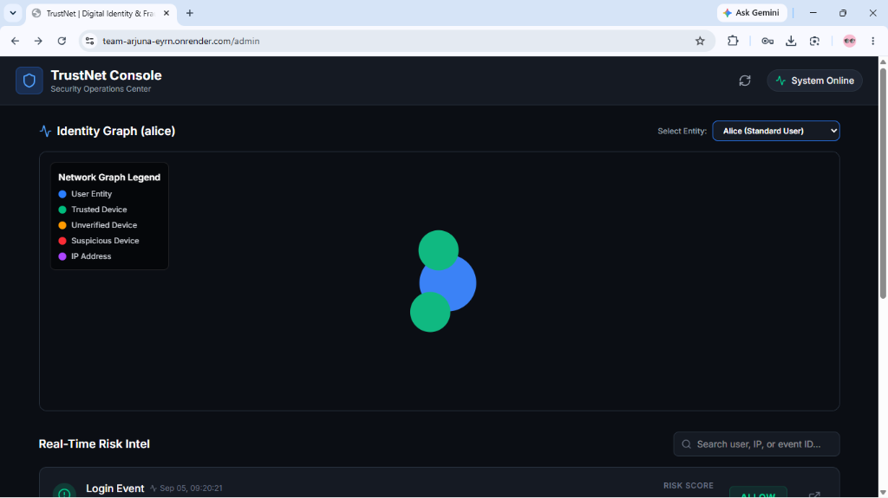
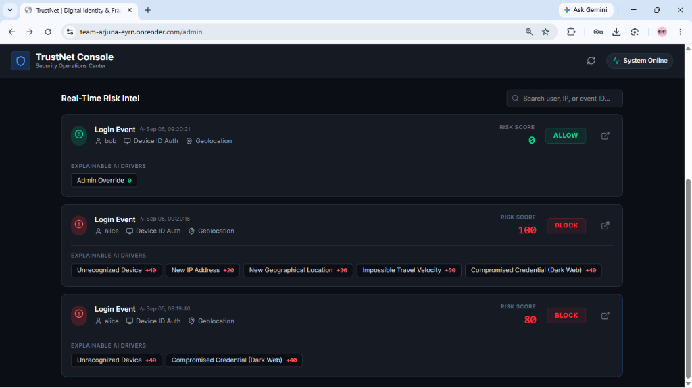
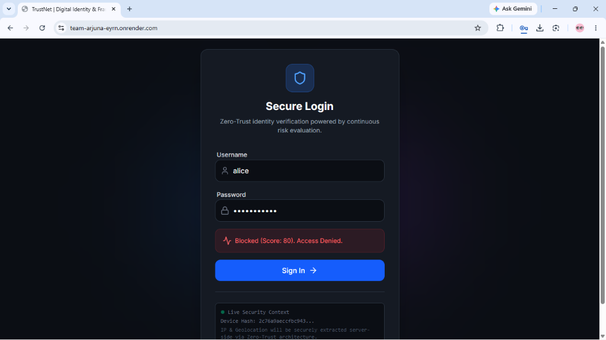

# 🛡️ TrustNet | AI-Powered Continuous Digital Trust & Fraud Intelligence

[](https://fastapi.tiangolo.com/)
[](https://nextjs.org/)
[](https://scikit-learn.org/)
[](https://www.sqlite.org/)
[](https://tailwindcss.com/)

> **Don't just verify identity once at login. Continuously evaluate digital trust.**  
> TrustNet is a next-generation Zero-Trust security engine that dynamically detects Account Takeover (ATO), bot automation, credential leaks, and impossible travel in real time using Machine Learning and Explainable AI (xAI).

---

## 📌 Executive Summary

Traditional Identity and Access Management (IAM) systems suffer from a fatal flaw: **binary static authentication**. Once a user enters a correct password, the system grants total access regardless of hardware anomalies, physical impossibility, or breach intelligence.

**TrustNet solves this** by replacing binary logins with a **Continuous Risk Engine (0 – 100 Risk Score)** powered by an **Isolation Forest ML model**, **Keystroke Biometrics**, **Live Geolocation Tracking**, and **Real-Time Dark Web Breach Intelligence**. Every access request is transparently scored, producing step-by-step **Explainable AI (xAI) drivers** for Security Operations Center (SOC) teams.

---

## 📸 Platform Screenshots

### 1. Interactive 2D Identity Graph & Entity Selector
Dynamic force-directed network graph visualizing user entities, registered hardware devices (trusted/suspicious), and IP nodes. Features a live **Select Entity** dropdown to inspect any user profile in real time.


---

### 2. Real-Time Risk Intel & Explainable AI (xAI) Drivers
Live SOC risk feed tracking authentication events with automated decisions (`ALLOW`, `CHALLENGE`, `BLOCK`) and transparent signal weighting (`+40 Unrecognized Device`, `+20 New IP`, `+30 New Geo`, `+50 Impossible Travel Velocity`, `+40 Compromised Credential`).



---

### 3. Secure Zero-Trust Authentication Portal
Minimalist client authentication portal capturing hardware fingerprinting and typing biometrics, providing instant visual feedback on blocked or challenged attempts.



---

## 🚀 Key Implemented Features

- 🧠 **Machine Learning Anomaly Detection:** An unsupervised **Isolation Forest** algorithm trained on temporal login behavior (hour of day, day of week, login velocity) to flag anomalous login timing.
- ⚡ **Keystroke Dynamics (Typing Biometrics):** Measures inter-key timing intervals. Sub-150ms password entries (e.g., scripted copy-paste or bot automation) instantly trigger bot detection penalties (+50 Risk Points).
- 🌐 **Live Geolocation & IP Reputation:** Intercepts client connections and performs live IP-to-Geolocation resolution to track geographical shifts.
- ✈️ **Impossible Travel Velocity:** Calculates spatial-temporal physical velocity between consecutive logins. Distances requiring supersonic speeds (< 4 hours between distant regions) trigger high-severity alerts (+50 Risk Points).
- 🔑 **Real-Time Dark Web Breach Lookup:** Hashes candidate passwords using SHA-1 (k-Anonymity model) and queries the **Have I Been Pwned (HIBP)** API in real time. Compromised credentials automatically incur a +40 Risk Penalty.
- 🔍 **Explainable AI (xAI) Drivers:** Replaces black-box AI decisions with exact, weighted risk factors (e.g., `+40 Unrecognized Device`, `+40 Compromised Credential`, `+50 Bot Automation`).
- 🕸️ **Interactive Identity Graph:** Renders dynamic 2D force-directed node graphs connecting users, hardware devices (trusted/suspicious), and IP nodes using D3 & `react-force-graph-2d`.
- 🎮 **Scenario Simulator:** Sandbox testing environment to simulate Baseline, Anomaly (3 AM login), and Account Takeover (ATO) attack scenarios.

---

## 🏗️ System Architecture

```mermaid
graph TD
    Client[📱 Web Client] -->|Login Request + Typing Biometrics + Fingerprint| Gateway[⚡ FastAPI Backend]
    
    subgraph "TrustNet Engine"
        Gateway --> Auth[🔐 Auth Controller]
        Auth --> HIBP[🔍 Dark Web Breach Check (HIBP API)]
        Auth --> Evaluator[🛡️ Risk Evaluator Engine]
        
        Evaluator --> FP[💻 Hardware Device Binding]
        Evaluator --> Geo[📍 IP & Geolocation Engine]
        Evaluator --> ML[🧠 Isolation Forest ML Model]
        Evaluator --> Bio[⌨️ Typing Biometrics Monitor]
    end
    
    Evaluator -->|Risk Score 0-100 + xAI Drivers| Decision{⚖️ Decision Matrix}
    
    Decision -->|< 30 Score| Allow[✅ ALLOW]
    Decision -->|30 - 69 Score| Challenge[⚠️ CHALLENGE / MFA]
    Decision -->|≥ 70 Score| Block[🚫 BLOCK]
    
    Auth --> DB[(💾 SQLite / SQLAlchemy DB)]
    DB --> AdminUI[📊 Next.js SOC Dashboard]
    DB --> GraphUI[🕸️ Identity Graph Component]
```

---

## 📊 Risk Scoring Matrix & Decision Rules

TrustNet evaluates incoming authentication requests against a cumulative 0–100 risk scale:

| Risk Score | Automated Action | Security Outcome |
| :---: | :---: | :--- |
| **0 – 29** | `ALLOW` | Low risk. Access granted seamlessly. |
| **30 – 69** | `CHALLENGE` | Moderate risk. Step-up authentication / MFA required. |
| **70 – 100** | `BLOCK` | Critical risk. Request blocked & ingested into SOC Console. |

### Signal Weighting Breakdown

| Signal Category | Trigger Condition | Weight Penalty / Credit |
| :--- | :--- | :---: |
| **Hardware Fingerprint** | Trusted registered device | **-10** |
| **Hardware Fingerprint** | Unrecognized / New device | **+40** |
| **Hardware Fingerprint** | Previously flagged suspicious device | **+50** |
| **IP Reputation** | Unseen IP address | **+20** |
| **Geolocation** | Unseen geographical location | **+30** |
| **Impossible Travel** | Geographic movement physical velocity < 4 hrs | **+50** |
| **Typing Biometrics** | Password entry duration < 150ms (Bot / Paste) | **+50** |
| **Dark Web Intelligence** | Password present in HIBP breach database | **+40** |
| **ML Anomaly Model** | Deviation from learned Isolation Forest baseline | **+20 to +40** |

---

## 🧠 AI / ML Implementation Details

TrustNet utilizes an **Isolation Forest** unsupervised learning model (`scikit-learn`) tailored per user profile:

- **Feature Vector:** `[hour_of_day, day_of_week, login_velocity_hours]`
- **Hyperparameters:** `n_estimators=100`, `contamination=0.20`
- **Training Strategy:** The model trains dynamically on historical session patterns. When a user attempts to log in at an unusual time (e.g., 3:15 AM vs. normal 9:00 AM baseline), the Isolation Forest identifies the anomaly score and assigns a proportional risk penalty (+20 to +40 points).
- **Explainability:** Model outputs are passed through custom heuristic explainers to format plain-English xAI alerts for security analysts.

---

## 🛠️ Technology Stack

### **Backend Framework & Core Engine**
- **Language:** Python 3.10+
- **API Framework:** FastAPI
- **ORM / Database:** SQLAlchemy with SQLite
- **Machine Learning:** `scikit-learn`, `numpy`, `scipy`
- **Security & Cryptography:** `bcrypt`, `pyjwt`, `hashlib`

### **Frontend & User Interface**
- **Framework:** Next.js 14 (App Router)
- **UI Library:** React 18
- **Styling:** Vanilla CSS & TailwindCSS (Dark Mode SOC theme)
- **Icons & Visualization:** `lucide-react`, `react-force-graph-2d`
- **Device Fingerprinting:** `@fingerprintjs/fingerprintjs`

---

## 📁 Repository Structure

```text
Team-Arjuna-/
├── assets/
│   └── images/              # Live application screenshots
│       ├── identity_graph.png
│       ├── realtime_risk_intel.png
│       └── secure_login.png
├── trustnet-backend/        # FastAPI Risk Engine & Service API
│   ├── api/                 # Endpoint routers (auth, admin, graph)
│   ├── core/                # JWT & password security utilities
│   ├── data/                # Database seeding scripts
│   ├── models/              # SQLAlchemy models & Pydantic schemas
│   ├── risk_engine/         # Isolation Forest ML model & Risk Evaluator
│   ├── main.py              # Application entrypoint & auto-seeding
│   └── requirements.txt     # Python dependencies
├── trustnet-web/            # Next.js SOC Dashboard & Client App
│   ├── app/                 # Next.js App Router (pages: /, /admin, /simulator)
│   │   ├── admin/           # SOC Console Dashboard page
│   │   ├── components/      # Trust Graph & UI components
│   │   └── simulator/       # Scenario Testing Simulator
│   ├── package.json         # Node.js dependencies
│   └── next.config.mjs      # Next.js configuration
├── README.md                # Project documentation
└── trustnet.db              # SQLite Database file
```

---

## 💻 Installation & Local Setup

### Prerequisites
- **Python 3.10+**
- **Node.js 18+** & `npm`
- **Git**

### 1. Clone Repository
```bash
git clone https://github.com/HRAGROUPS/Team-Arjuna-.git
cd Team-Arjuna-
```

### 2. Backend Setup
```bash
cd trustnet-backend
python -m venv venv

# On Windows:
venv\Scripts\activate
# On Linux/macOS:
source venv/bin/activate

pip install -r requirements.txt
```

Run the backend server:
```bash
uvicorn main:app --reload --host 0.0.0.0 --port 8000
```
*The FastAPI backend will run on `http://localhost:8000`. Automatic DB creation and seeding will trigger on initial boot.*

### 3. Frontend Setup
In a new terminal window:
```bash
cd trustnet-web
npm install
npm run dev
```
*The Next.js frontend will run on `http://localhost:3000`.*

---

## 🧪 Demo & Testing Guide

| Route | Purpose | Description |
| :--- | :--- | :--- |
| `http://localhost:3000/` | **Client Login** | Test real login with live typing biometrics & fingerprinting |
| `http://localhost:3000/admin` | **SOC Console** | Monitor real-time risk alerts and interact with the 2D Identity Graph |
| `http://localhost:3000/simulator` | **Scenario Simulator** | Test pre-configured Baseline, ML Anomaly (3 AM), and Attack scenarios |

### Recommended Demo Scenarios

1. **Test Bot Automation / Copy-Paste:**
   - Go to `http://localhost:3000/`.
   - Copy the password `password123` and **paste** it directly into the password box (`Ctrl+V`).
   - Submit login. The system catches the 0ms typing speed and triggers `Bot Automation (+50)`.

2. **Test Dark Web Credential Detection:**
   - Log in as user `alice` with password `password123`.
   - The engine hashes the password, queries HIBP, and flags `Compromised Credential (Dark Web) (+40)`.

3. **Test Admin / Trusted Bypass:**
   - Log in as `bob` or `admin`.
   - The engine applies the Admin Override, returning a Risk Score of **0 (`ALLOW`)**.

---

## 🔗 Implemented API Endpoints

### 🔐 Authentication & Evaluation
- `POST /api/v1/auth/login` — Evaluates authentication payload against device, IP, location, typing biometrics, HIBP dark web API, and ML model.

### 📊 SOC & Security Operations
- `GET /api/v1/admin/alerts` — Retrieves chronological audit list of recent risk assessments and explainability drivers.

### 🕸️ Identity Graph
- `GET /api/v1/graph/{username}` — Generates JSON node/link structures for 2D network visualization.

---

## 📈 Current Status & Future Roadmap

### ✅ Implemented in Current Version
- [x] Multi-factor risk engine (0-100 scoring scale)
- [x] Isolation Forest ML model for temporal anomalies
- [x] Sub-150ms typing biometrics bot detector
- [x] Live HIBP Dark Web breach API integration
- [x] Impossible Travel velocity detection
- [x] Explainable AI (xAI) signal attribution
- [x] Interactive 2D Identity Graph (D3 Force Graph)
- [x] Live SOC Admin Console & Scenario Simulator

### 🔮 Planned Future Enhancements
- [ ] **Native Step-Up Challenge Modal:** In-app TOTP / WebAuthn prompt when action is `CHALLENGE`.
- [ ] **Distributed Graph Database:** Migration from relational models to Neo4j for enterprise-scale entity graphs.
- [ ] **High-Concurrency Caching:** Redis caching layer for sub-millisecond risk evaluation at scale.
- [ ] **Mobile Application Parity:** React Native Expo mobile build for iOS & Android companion apps.

---

<p center="text-center">
  <b>Developed with ❤️ by Team Arjuna</b>
</p>
